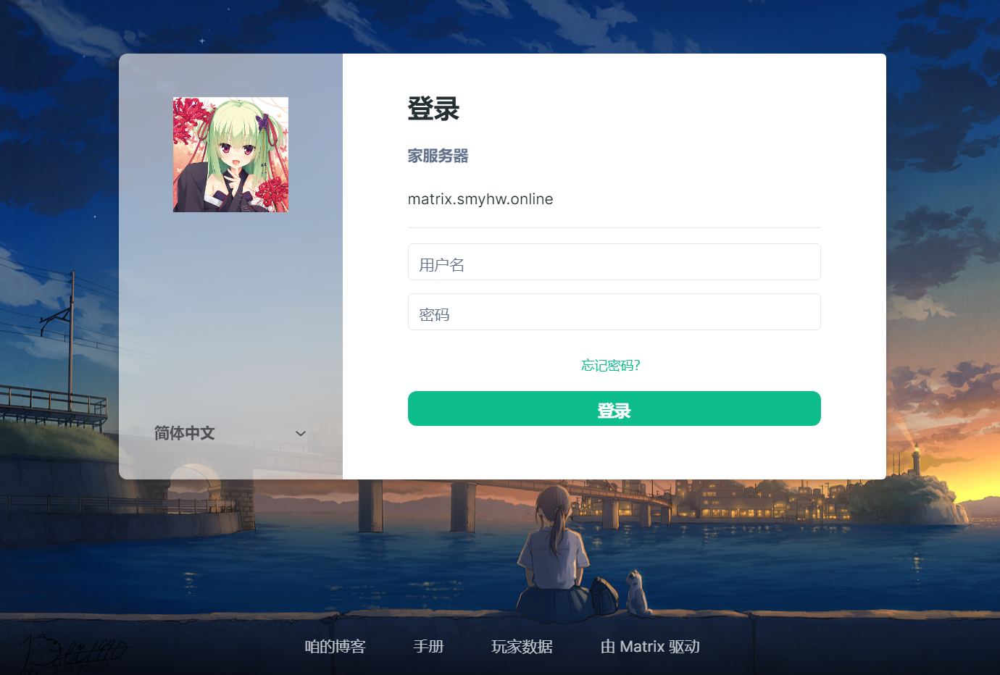
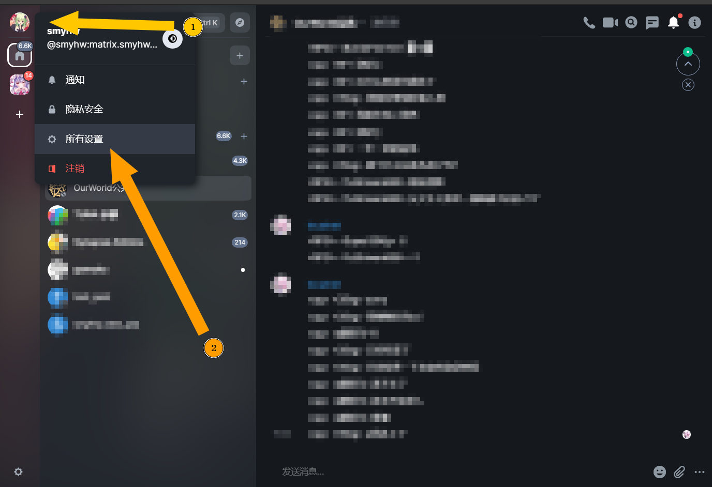
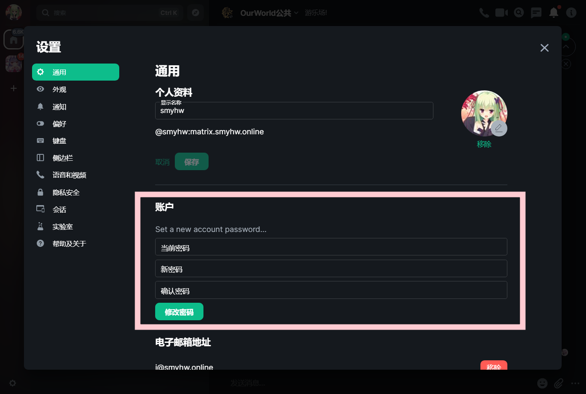

### 写在前面

**用户中心的地址:[im.smyhw.online](https://im.smyhw.online)**

> 资源托管在cloudflare，连不上自行解决网络问题，咱不想回答任何连不上，打不开网页的问题:(

> 请使用桌面端访问用户中心，移动端工作正常，但咱不会回答因使用移动端产生的任何问题

*** 

### 一.登入用户中心
这里的用户名密码就是汝登入游戏时使用的玩家id和密码

* 如果默认为英文界面，语言选择中有简体中文

### 二.打开设置
如图，打开设置页面

### 三.更改密码
在这里更改密码

**按钮点了没反应请等待一会，它只是反应比较慢**  
注意：这里的当前密码是未更改的密码，新密码才是要更改到的密码
(*真的会有玩家会搞不懂qwq*)

### 四.退出并重新登入
**退出用户中心并重新登入**
这是必要步骤，否则新密码不会生效